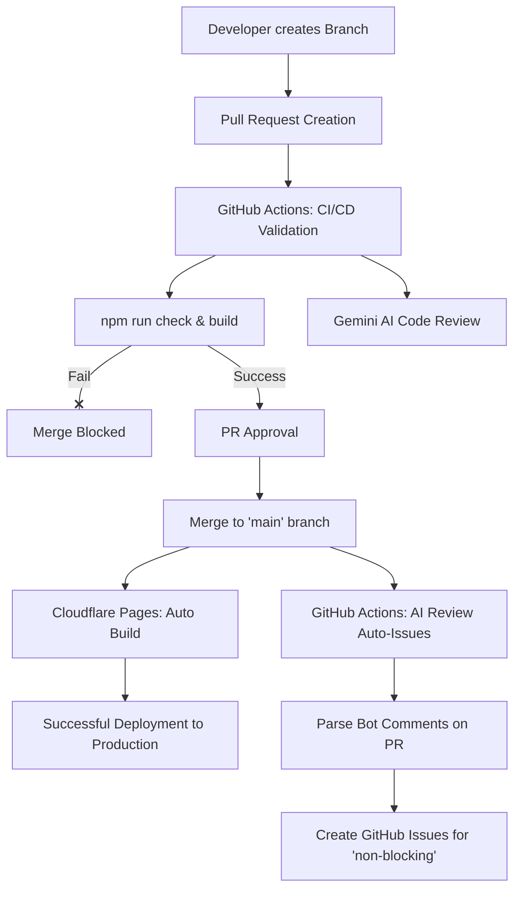

# CI/CD Pipeline Documentation (Continuous Integration and Deployment)

This document details the operation, architecture, and instructions for the CI/CD pipeline of the **escal-ai-website** project.

---

## 🛠️ General Pipeline Architecture

The code lifecycle is divided into two independent phases to ensure that the `main` branch is always kept stable and free of build errors:



---

## 1. Pull Request Validation (GitHub Actions)

Every time a Pull Request (PR) targeting the `main` branch is opened or an existing branch is updated with new commits, the GitHub Actions workflow defined in [.github/workflows/validate-pr.yml](file:///Users/george/Documents/development/escal-ai-website/.github/workflows/validate-pr.yml) is executed.

### Triggers
* **Events**: `pull_request` (types: `opened`, `synchronize`, `reopened`).
* **Target Branch**: `main`.

### Workflow Step Sequence

1. **Checkout Code**: Downloads the complete source code (including the commit history required to compare the diff).
2. **Setup Node.js**: Installs and configures Node.js version 22 with caching support for `npm`.
3. **Install Dependencies**: Runs `npm ci` to install the exact dependencies from the `package-lock.json` file.
4. **Code Validation (Astro Check)**: Runs `npm run check` to analyze TypeScript types and the structure of `.astro` files for errors.
5. **Static Site Build**: Runs `npm run build` to ensure the site compiles correctly. The output is temporarily stored in the `/dist/` directory.
6. **Gemini AI Review (Optional on PRs)**:
   * Compares the changes of your branch with `main` to generate a `pr.diff` file (excluding noise from dependency changes in `package-lock.json`).
   * Calls the local script [scripts/ai-review.mjs](file:///Users/george/Documents/development/escal-ai-website/scripts/ai-review.mjs) passing the diff and using the `GEMINI_API_KEY` secret.
   * Posts or updates an interactive comment on the GitHub PR with suggestions, potential bugs, and performance improvements.

### Secrets Used in GitHub
* `GITHUB_TOKEN` (built-in GitHub secret): Allows the action to automatically post review comments on the PR.
* `GEMINI_API_KEY`: Google Gemini API Key to process the code diff and generate the automated review.

---

## 2. Production Deployment (Cloudflare Pages)

The final deployment of the website is directly connected to the `main` branch in Cloudflare Pages, following the concept of passive and optimized deployments.

### Configuration in the Cloudflare Pages Panel:

To avoid unnecessary builds of development branches and keep the workflow clean, the following rules are applied under the **Settings** > **Builds & deployments** > **Branch control** tab:

1. **Production Deployments (Automatic)**:
   * **Option**: `Enable automatic production branch deployments` (Enabled).
   * **Action**: Every time a merge or a direct push is made to the `main` branch, Cloudflare Pages detects the change, builds your Astro project, and updates the production site (`https://escal-ai.com`).
2. **Preview Deployments (Disabled)**:
   * **Option (Preview branch)**: `None (Disable automatic branch deployments)`.
   * **Action**: Cloudflare will **not** build temporary previews for PRs. PR verification is done exclusively through GitHub Actions checks.

---

## 3. Automatic Issue Creation (Upon merging PRs)

To ensure that AI suggestions are not lost in the PR history, an automated workflow defined in [.github/workflows/create-issues-on-merge.yml](file:///Users/george/Documents/development/escal-ai-website/.github/workflows/create-issues-on-merge.yml) is executed when the merge is completed.

### Triggers
* **Event**: `pull_request` (type: `closed`).
* **Condition**: The PR must have been merged (`merged: true`) into the `main` branch.

### Process Flow
1. **Search for Report**: The script reads all comments on the PR searching for the bot comment (`🤖 AI Review Report - escal-ai`).
2. **Extraction and Cleanup**: Uses a regular expression to identify all blocks marked as `suggestion [non-blocking]` or `issue [non-blocking]`.
3. **GitHub Issue Creation**: For each match, it creates a new GitHub Issue:
   * **Title**: Cleans special characters and truncates the suggestion to 60 characters.
   * **Body**: Details the bot's feedback and links back to the source PR.
   * **Labels**: Assigns descriptive labels: `ai-review`, `non-blocking`, and `bug` (for issues) or `enhancement` (for suggestions).

---

## 🚦 Development Instructions and Best Practices

To work smoothly with this pipeline, you must follow the structured Git flow:

### 1. Work in specific branches
Never push commits directly to `main` (it is locked on GitHub). Always create an appropriate branch:
```bash
git checkout -b feature/your-change-name   # For enhancements and features
git checkout -b fix/your-change-name       # For bug fixes
```

### 2. Validate your code locally before pushing
Save CI/CD time by running validations on your local machine:
```bash
npm run check  # Verifies Astro and TypeScript errors
npm run build  # Verifies that the production compilation is correct
```

### 3. Create the Pull Request
Push your branch and create the PR on GitHub. Check the results in the **Checks** tab:
* If the checks are green: The code compiles and complies with the rules.
* Check the bot's comment `🤖 AI Review Report - escal-ai` in the conversation tab to read the model's recommendations.

### 4. Merge to production
Once the PR is approved, use the **Squash and Merge** option on GitHub to merge it. Upon completion, Cloudflare Pages will automatically trigger the final publication, and in about 1 minute the site will be updated.

---

## 🔍 Troubleshooting

### Build fails in GitHub Actions but compiles on my PC
* Make sure you have uploaded all necessary files and there are no differences due to ignoring essential files in `.gitignore`.
* Verify that you have not modified `package.json` by adding dependencies that do not exist in `package-lock.json` (run `npm install` locally to update it before pushing).

### AI Review does not appear on my PR
* Check that the `GEMINI_API_KEY` secret is configured in your GitHub repository settings.
* If the PR only contains changes to files that do not modify code (such as documentation in `.md` or the `package-lock.json` file), the script will automatically skip the review to optimize API costs.
* If the Gemini API is down or out of quota, the pipeline will continue in green without blocking the integration (emergency bypass).

### Cloudflare does not update the website after merging
* Verify the logs directly in the Cloudflare Pages panel under > **Deployments**.
* Check that the production branch name configured in Cloudflare exactly matches the main branch in your repository (should be `main`).
