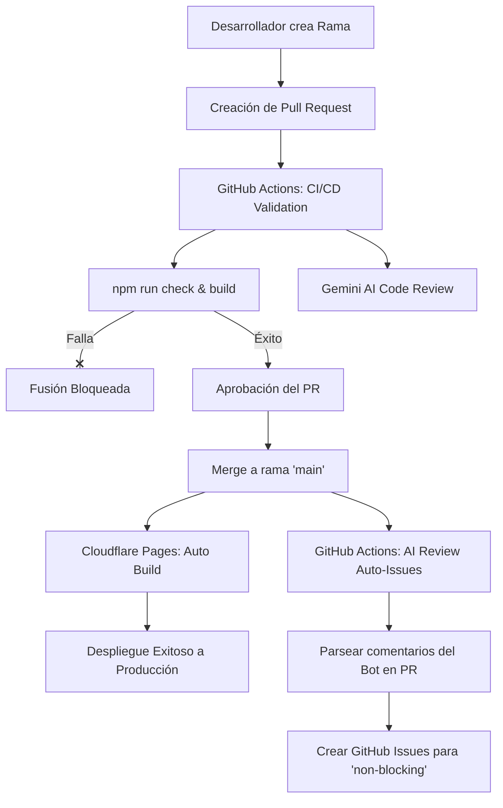

# Documentación del Pipeline de CI/CD (Integración y Despliegue Continuo)

Este documento detalla el funcionamiento, la arquitectura y las instrucciones del pipeline de CI/CD para el proyecto **escal-ai-website**.

---

## 🛠️ Arquitectura General del Pipeline

El ciclo de vida del código se divide en dos fases independientes para garantizar que la rama `main` siempre se mantenga estable y libre de errores de compilación:



---

## 1. Validación en Pull Requests (GitHub Actions)

Cada vez que se abre un Pull Request (PR) apuntando a la rama `main`, o se actualiza una rama existente con nuevos commits, se ejecuta el workflow de GitHub Actions definido en [.github/workflows/validate-pr.yml](file:///Users/george/Documents/development/escal-ai-website/.github/workflows/validate-pr.yml).

### Disparadores (Triggers)
* **Eventos**: `pull_request` (tipos: `opened`, `synchronize`, `reopened`).
* **Rama Destino**: `main`.

### Secuencia de Pasos del Workflow

1. **Checkout del Código**: Descarga el código fuente completo (incluyendo el historial de commits necesario para comparar el diff).
2. **Setup de Node.js**: Instala y configura la versión 22 de Node.js con soporte de caché para `npm`.
3. **Instalación de Dependencias**: Ejecuta `npm ci` para instalar exactamente las dependencias del archivo `package-lock.json`.
4. **Validación de Código (Astro Check)**: Ejecuta `npm run check` para analizar el tipado en TypeScript y la estructura de los archivos `.astro` en busca de errores.
5. **Compilación del Sitio (Build)**: Ejecuta `npm run build` para asegurar que el sitio compila correctamente. La salida se almacena temporalmente en el directorio `/dist/`.
6. **Gemini AI Review (Opcional en PRs)**:
   * Compara los cambios de tu rama con `main` para generar un archivo `pr.diff` (excluyendo ruidos de dependencias en `package-lock.json`).
   * Llama al script local [scripts/ai-review.mjs](file:///Users/george/Documents/development/escal-ai-website/scripts/ai-review.mjs) pasando el diff y usando la clave `GEMINI_API_KEY`.
   * Publica o actualiza un comentario interactivo en el PR de GitHub con sugerencias, fallos potenciales y mejoras de rendimiento.

### Secretos Utilizados en GitHub
* `GITHUB_TOKEN` (interno de GitHub): Permite a la acción publicar comentarios de revisión automáticamente en el PR.
* `GEMINI_API_KEY`: API Key de Google Gemini para procesar el diff del código y generar la revisión automatizada.

---

## 2. Despliegue en Producción (Cloudflare Pages)

El despliegue final del sitio web está conectado directamente a la rama `main` en Cloudflare Pages, siguiendo el concepto de despliegues pasivos y optimizados.

### Configuración en el Panel de Cloudflare Pages:

Para evitar compilaciones innecesarias de ramas en desarrollo y mantener el flujo limpio, se aplican las siguientes reglas bajo la pestaña **Settings** > **Builds & deployments** > **Branch control**:

1. **Despliegues de Producción (Automáticos)**:
   * **Opción**: `Enable automatic production branch deployments` (Activada).
   * **Acción**: Cada vez que se hace un *merge* o un *push* directo a la rama `main`, Cloudflare Pages detecta el cambio, compila tu proyecto Astro y actualiza el sitio en producción (`https://escal-ai.com`).
2. **Despliegues de Vista Previa (Desactivados)**:
   * **Opción (Preview branch)**: `None (Disable automatic branch deployments)`.
   * **Acción**: Cloudflare **no** compilará vistas previas temporales para los PRs. La verificación de los PRs se hace de forma exclusiva a través de los tests de GitHub Actions.

---

## 3. Creación Automática de Issues (Al fusionar PRs)

Para asegurar que las sugerencias de la IA no se pierdan en el historial del PR, se ejecuta un workflow automatizado definido en [.github/workflows/create-issues-on-merge.yml](file:///Users/george/Documents/development/escal-ai-website/.github/workflows/create-issues-on-merge.yml) cuando se completa la fusión.

### Disparadores (Triggers)
* **Evento**: `pull_request` (tipo: `closed`).
* **Condición**: El PR debe haber sido fusionado (`merged: true`) en la rama `main`.

### Flujo del Proceso
1. **Búsqueda del Reporte**: El script lee todos los comentarios del PR buscando el comentario del bot (`🤖 AI Review Report - escal-ai`).
2. **Extracción y Limpieza**: Utiliza una expresión regular para identificar todos los bloques marcados como `suggestion [non-blocking]` o `issue [non-blocking]`.
3. **Creación en GitHub**: Para cada coincidencia, crea un nuevo GitHub Issue:
   * **Título**: Limpia caracteres especiales y resume la sugerencia a 60 caracteres.
   * **Cuerpo**: Detalla el feedback del bot y enlaza al PR de origen.
   * **Etiquetas**: Asigna etiquetas descriptivas: `ai-review`, `non-blocking`, y `bug` (para issues) o `enhancement` (para sugerencias).

---

## 🚦 Instrucciones y Buenas Prácticas de Desarrollo

Para trabajar con este pipeline de forma fluida, debes seguir el flujo de Git estructurado:

### 1. Trabajar en ramas específicas
Nunca envíes commits directamente a `main` (está bloqueado en GitHub). Crea una rama adecuada:
```bash
git checkout -b feature/nombre-de-tu-cambio   # Para mejoras y features
git checkout -b fix/nombre-de-tu-cambio       # Para corregir bugs
```

### 2. Validar tu código localmente antes de subirlo
Ahorra tiempo de CI/CD corriendo las validaciones en tu máquina local:
```bash
npm run check  # Verifica errores de Astro y TypeScript
npm run build  # Verifica que la compilación de producción sea correcta
```

### 3. Crear el Pull Request
Sube tu rama y crea el PR en GitHub. Revisa los resultados en la pestaña de **Checks**:
* Si los checks están en verde: El código compila y cumple las reglas.
* Revisa el comentario del bot `🤖 AI Review Report - escal-ai` en la pestaña de conversación para leer las recomendaciones del modelo de lenguaje.

### 4. Merge a producción
Una vez aprobado el PR, utiliza la opción **Squash and Merge** en GitHub para fusionarlo. Al completarse, Cloudflare Pages iniciará automáticamente la publicación final y en aproximadamente 1 minuto la web estará actualizada.

---

## 🔍 Solución de Problemas (Troubleshooting)

### El build falla en GitHub Actions pero compila en mi PC
* Asegúrate de haber subido todos los archivos necesarios y que no haya diferencias por ignorar archivos esenciales en `.gitignore`.
* Verifica que no hayas modificado `package.json` agregando dependencias que no existan en `package-lock.json` (usa `npm install` localmente para actualizarlo antes de subir).

### El AI Review no aparece en mi PR
* Revisa que el secreto `GEMINI_API_KEY` esté configurado en los ajustes de tu repositorio de GitHub.
* Si el PR solo contiene cambios en archivos que no modifican código (como la documentación en `.md` o el archivo `package-lock.json`), el script omitirá la revisión automáticamente para optimizar costos de API.
* Si la API de Gemini está caída o sin saldo, el pipeline continuará en verde sin bloquear la integración (emergencia).

### Cloudflare no actualiza la web tras hacer merge
* Verifica los logs directamente en el panel de Cloudflare Pages > **Deployments**.
* Revisa que el nombre de la rama de producción configurada en Cloudflare coincida exactamente con la rama principal en tu repositorio (debe ser `main`).
